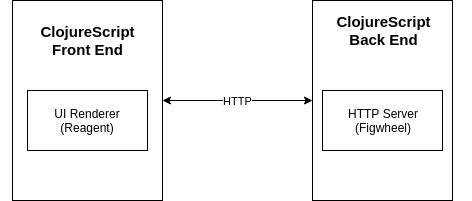

# Clojure Tictactoe

Tic tac toe application against a computer. Implement in Clojure and using ClojureScript to display into browser. 

## Setup

To run it locally on your computer, run: 

    lein figwheel

And open your browser at [localhost:8001](http://localhost:8001/).

## Playing the game

This game allows you to play Tic-tac-toe in a 3x3 setting. When you go to your localhost, squares will be displayed, each one of them representing a position in the game. You are represented in the game by a circle, computer is represented by a cross. To start playing, click a position and this will mark this position with a circle. Inmediately after, the computer will mark a new position and then you can follow the game marking a new position and so on. 

When the computer wins, you will read a 'You lose' message at top of the window. When you win, you will read a 'It's a win' message at the top of the windows. 

You can start a new game by clicking the 'Play again' button. 

## Architecture 

This application is built using ClojureScript. A compiler for Clojure that targets JavaScript. Code is displayed in the browser using Figwheel that builds ClojureScript code and loads it into the browser by creating an HTTP Server. Game Logic of the game is coded into core.cljs and compiled to Javascript using ClojureScript, then this compiled ClojureScript file manages the logic of the game while in the web browser. 
